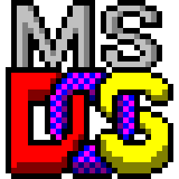
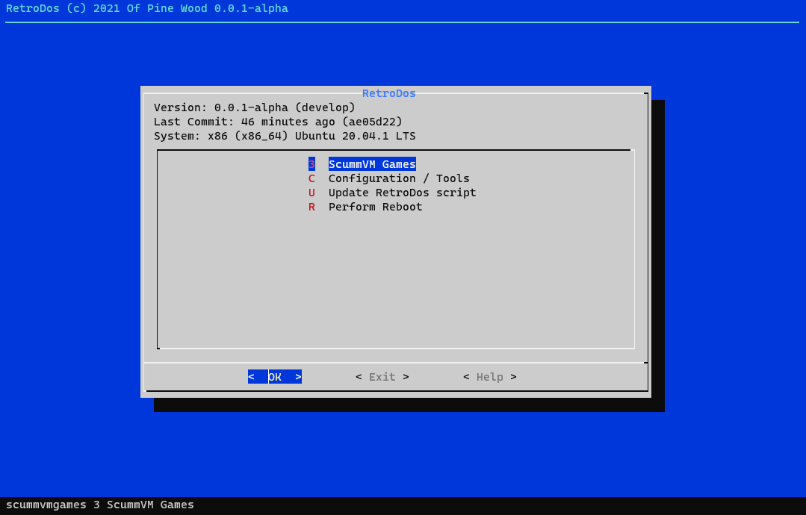

# RetroDos 

[](https://github.com/ofpinewood/retro-dos/blob/master/LICENSE)

RetroDos is a front-end for the RetroPie project. It's a bash script that displays menus.



## General Usage
RetroDos is a shell script to start your ScummVM games and manage some configuration.

To run the RetroDos script make sure that your APT repositories are up-to-date and that Git is installed:

``` bash
sudo apt-get update
sudo apt-get dist-upgrade
sudo apt-get install git
```

You can then download the latest RetroDos script with:

``` bash
cd
git clone --depth=1 https://github.com/ofpinewood/retro-dos.git
```

The script is executed with:

``` bash
cd retro-dos
sudo ./retrodos.sh
```

> Note: When you first run the script it may install some additional packages that are needed.

## Development
All development will happen in its own feature branch, since the `main` branch is also the production version for the script.

``` bash
cd
git clone --depth=1 --single-branch --branch <feature> https://github.com/ofpinewood/retro-dos.git
```

References:
- [RetroPie](https://retropie.org.uk/)
- [Linux Shell Scripting Tutorial](https://bash.cyberciti.biz/guide)

### Windows development
Windows Subsystem for Linux is recommended to develop on Windows.

- [Windows Subsystem for Linux](https://docs.microsoft.com/en-us/windows/wsl/install-win10)

Make script files executable before checking them in.

``` cmd
git update-index --chmod=+x scriptmodules/<script>.sh;
```

### DosBox
Fullscreen stuff: https://retropie.org.uk/forum/topic/25178/dosbox-on-pi-4-game-window-is-fullscreen-but-not-centered-on-screen/97?_=1614883985849&lang=en-US  
PI4+DosBox: https://retropie.org.uk/forum/topic/25041/dosbox-official-thread  
Compatibility: https://www.dosbox.com/comp_list.php  

#### Configuration
```
[sdl]
fullscreen       = true
fulldouble       = false
fullresolution   = desktop
windowresolution = original
output           = openglnb
autolock         = true
sensitivity      = 100
waitonerror      = true
priority         = higher,normal
mapperfile       = mapper-SVN.map
usescancodes     = false

[dosbox]
language = 
machine  = svga_s3
captures = capture
memsize  = 16

[render]
frameskip = 0
aspect    = true
scaler    = normal3x
```

> References  
> - https://wiki.learnlinux.tv/index.php/Running_Classic_MS-DOS_games_on_the_Pi_400
> - https://www.dosbox.com/wiki/Dosbox.conf

##### OpenGL (output=openglnb)
Uses OpenGL. Does not use bilinear filtering so pixels are pixelated.

#### Turn on dispmanx
One option to fix tearing is to turn on `dispmanx` in RetroPie setup. It does fix tearing yet it decreases performance in few games (eg. Alone in the Dark, Wolf3D, Crusader, etc).

```
RetroPie-Setup -> Configuration / Tools -> dispmanx // switch it on for DOSBOX
```

## Contributing
We accept fixes and features! Here are some resources to help you get started on how to contribute code or new content.

* [Contributing](https://github.com/ofpinewood/retro-dos/blob/master/CONTRIBUTING.md)
* [Code of conduct](https://github.com/ofpinewood/retro-dos/blob/master/CODE_OF_CONDUCT.md)

## Acknowledgments
- [RetroPie-Setup](https://github.com/RetroPie/RetroPie-Setup) for the bash script inspiration.

---
Copyright &copy; 2020, [Of Pine Wood](http://ofpinewood.com).
Created by [Peter van den Hout](http://ofpinewood.com).
Released under the terms of the [MIT license](https://github.com/ofpinewood/retro-dos/blob/master/LICENSE).
